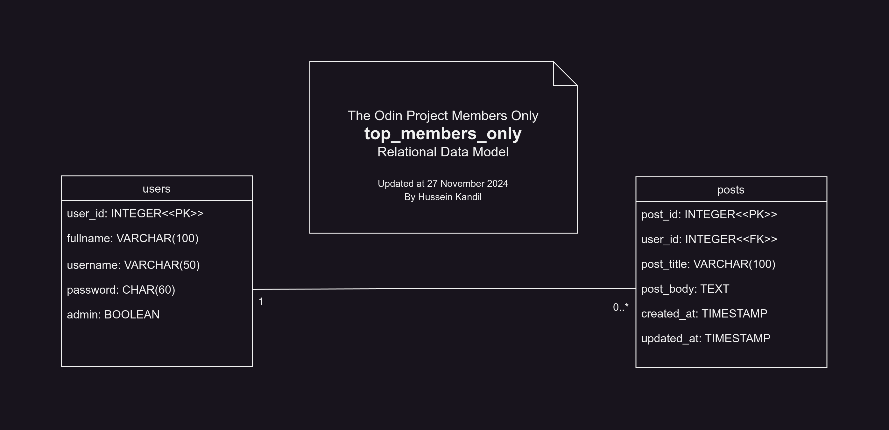

# Odin Members Only

An exclusive clubhouse developed as part of [**The Odin Project's Node.js course**](https://www.theodinproject.com/paths/full-stack-javascript/courses/nodejs). Members can see post authors, but non-members only see the story and wonder who wrote it. While this app may seem silly, it helps me practice essential back-end skills like user creation, authentication, and managing permissions.

## Relational Data Model

